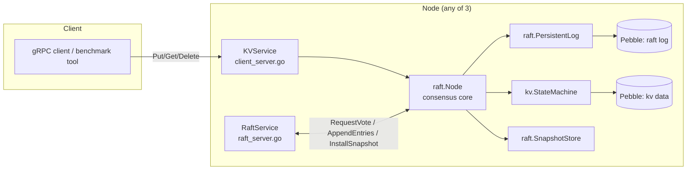
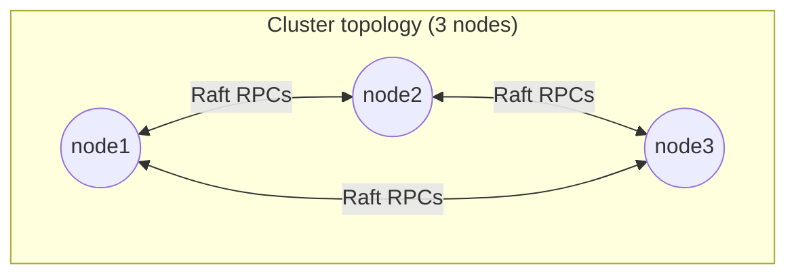
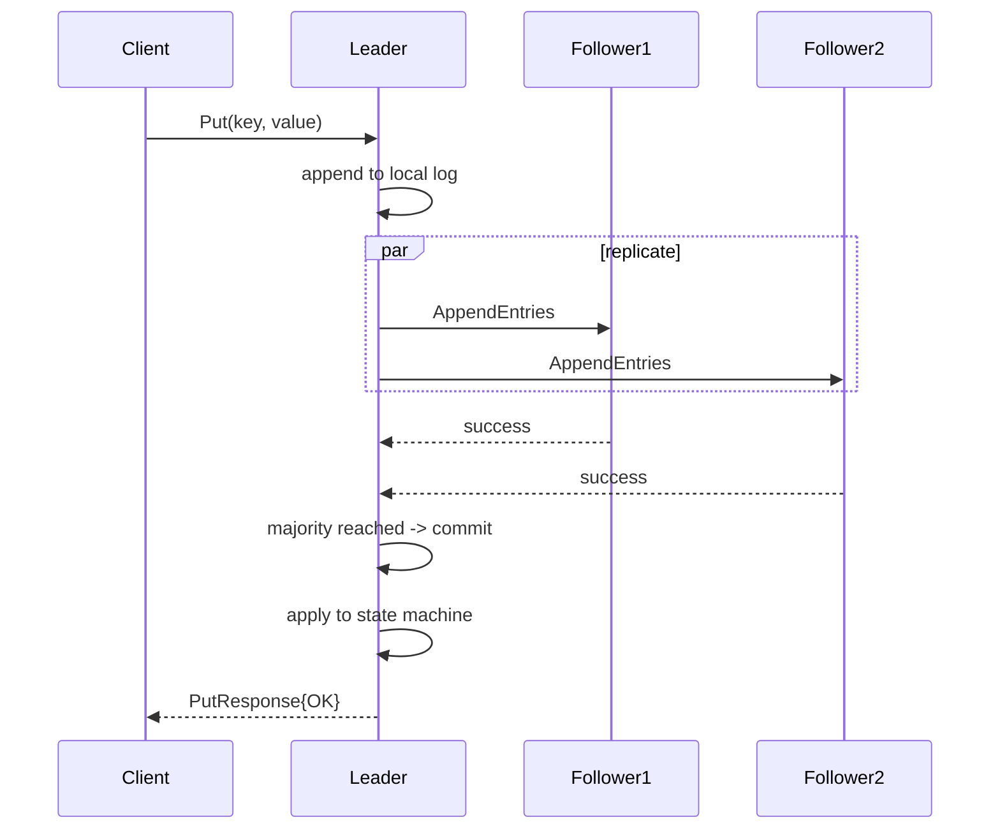

# distributed-kv

A linearizable, replicated key-value store built from scratch in Go, using
the Raft consensus algorithm, gRPC/Protocol Buffers for all node-to-node
and client-facing communication, and an embedded LSM storage engine
(Pebble) for persistence.

>
## Contents

- [Architecture](#architecture)
- [Raft consensus](#raft-consensus)
- [Linearizable reads](#linearizable-reads)
- [Persistent storage](#persistent-storage)
- [Snapshots and log compaction](#snapshots-and-log-compaction)
- [Fault tolerance](#fault-tolerance)
- [gRPC API](#grpc-api)
- [Setup](#setup)
- [Running the cluster](#running-the-cluster)
- [Benchmarking](#benchmarking)
- [Testing](#testing)
- [Tradeoffs and limitations](#tradeoffs-and-limitations)
- [Scaling considerations](#scaling-considerations)

## Architecture



Three independent processes (`cmd/node`) form a cluster. Each exposes two
gRPC services on two separate ports:

- **KVService** (client-facing): `Put`, `Get`, `Delete`.
- **RaftService** (internal): `RequestVote`, `AppendEntries`,
  `InstallSnapshot`.

`internal/raft` implements consensus with **no dependency on gRPC or
generated protobuf code** - it defines its own request/response structs and
a `Transport` interface. `internal/server` is the thin adapter that
translates between generated protobuf types and `internal/raft`'s types,
and hosts the actual gRPC servers/clients. This separation means the
consensus algorithm can be (and is, in `internal/raft/cluster_test.go`)
tested with a fake in-process transport, independent of gRPC generation.



### Client request flow



If a client contacts a non-leader node, that node returns
`NOT_LEADER` with a `leader_hint` (the leader's client-facing address)
rather than silently forwarding the request. This keeps the hot write path
to a single network hop once a client has learned the current leader
(exactly what `cmd/benchmark` does), at the cost of one extra round trip
the first time / after a leadership change.

## Raft consensus

Implemented per the original Raft paper (Ongaro & Ousterhout, 2014) in
`internal/raft`:

- **Leader election**: `election.go` - randomized election timeouts
  (`ElectionTimeoutMin`/`Max`, default 300-600ms), `RequestVote` RPC with
  the standard log-up-to-date comparison, term-based step-down.
- **Log replication**: `replication.go` - `AppendEntries` RPC with
  `prevLogIndex`/`prevLogTerm` consistency checks, conflict detection with
  the fast-backtracking optimization (follower returns the conflicting
  term and its first index so the leader can jump `nextIndex` in one round
  trip), and majority-based commit index advancement that respects the
  "leader completeness" rule (a leader only counts a majority for entries
  from its **own** current term; older-term entries commit implicitly once
  a current-term entry does).
- **Persistent state**: `log.go` - `currentTerm`, `votedFor`, and the log
  itself, all durable (see [Persistent storage](#persistent-storage)).
- **Volatile state**: `commitIndex`, `lastApplied`, and (leader-only)
  `nextIndex`/`matchIndex` per peer, held in `raft.Node`.

## Linearizable reads

**Chosen approach: ReadIndex** (`readindex.go`), not a committed no-op log
entry per read.

Rationale: a log-entry-per-read approach (some early Raft
implementations) is simplest to reason about but pays the full disk-fsync
and replication cost of a write for every read, which would be wasteful
for a read-heavy workload and directly hurts the write-throughput target
by competing for the same log/replication pipeline. ReadIndex instead:

1. Records the current `commitIndex` as the read's target index.
2. Confirms this node is still leader by exchanging one heartbeat round
   with a majority of peers *in the current term* - if a majority responds
   in the same term, no other node could have since been elected leader
   (an election requires a majority vote, and any newer leader's
   heartbeat would have already caused this node to step down before it
   could get a majority of confirmations).
3. Waits for local `lastApplied >= readIndex` (usually already true) before
   answering from local state.

This makes `Get(..., linearizable=true)` a leader-only operation with no
log write at all, at the cost of one RPC round-trip per read for step 2
(itself often piggybacked with the leader's regular heartbeats -
`confirmLeadership` reuses the same `AppendEntries` RPC).

A client may also request a **non-linearizable** read (`linearizable=false`)
against any node, served directly from that node's local (possibly stale)
applied state - useful for read-heavy workloads that can tolerate eventual
consistency in exchange for no cross-node round trip at all. Followers
always reject `linearizable=true` requests with `NOT_LEADER`
(`tests/raft_test.go::TestFollowerRejectsLinearizableRead`), since only the
leader can execute the ReadIndex protocol.

## Persistent storage

**Storage engine: [Pebble](https://github.com/cockroachdb/pebble)**
(`internal/storage/pebble.go`), a pure-Go, embedded LSM-tree engine
maintained by CockroachDB, chosen over:

- Real LevelDB/RocksDB cgo bindings: fragile cross-compilation, especially
  targeting the slim/distroless Docker image used here.
- `goleveldb`: effectively unmaintained.

The consensus and state-machine layers depend only on
`internal/storage.Engine`, a small interface (`Get`/`Set`/`Delete`/`Batch`/
`Iterator`), not on Pebble directly - swapping in Badger or another engine
means implementing that one interface.

Each node runs **two independent Pebble instances**:

| Instance | Keyspace prefix | Contents |
|---|---|---|
| `<data_dir>/raftlog` | `l/<index>` | Raft log entries (gob-encoded) |
| `<data_dir>/raftlog` | `m/*` | `currentTerm`, `votedFor`, snapshot boundary |
| `<data_dir>/kvdata` | `d/<key>` | Committed key-value pairs |

Every write to `currentTerm`/`votedFor` and every log append is committed
via a Pebble batch with `Sync: true` by default (`FSYNC_ON_APPEND=true`),
i.e. fsynced to disk before being acknowledged as durable, satisfying the
Raft persistence requirement (§5.6 of the paper: these must survive a
crash before a vote is cast or an entry is counted toward a majority).
Setting `FSYNC_ON_APPEND=false` relaxes this to batched/periodic fsync for
higher throughput at the cost of a small durability window on OS/power
crash (not process crash) - see [Tradeoffs](#tradeoffs-and-limitations);
any benchmark run in that mode must report it explicitly (RESULTS.md has a
field for this).

## Snapshots and log compaction

- `internal/kv/state_machine.go`'s `Dump`/`Restore` capture/replace the
  entire KV keyspace.
- `internal/raft/snapshot.go`'s `SnapshotStore` persists the dump plus
  `{LastIncludedIndex, LastIncludedTerm}` to plain files (write-tmp,
  fsync, rename - so a crash mid-write can never leave a corrupt snapshot
  visible), separate from the two Pebble instances since snapshots are
  large, infrequent, whole-blob writes rather than incremental KV traffic.
- Every `SnapshotThreshold` (default 10,000) applied entries, a snapshot is
  taken and the log is compacted up to that index
  (`PersistentLog.CompactPrefix`).
- A follower whose required log entries have already been compacted away
  on the leader is caught up via `InstallSnapshot`
  (`HandleInstallSnapshot`), which replaces its entire local state machine
  and resets its log boundary, rather than replaying history it no longer
  has access to.
- On startup, a node loads its latest local snapshot (if any) before
  accepting traffic, so state machine content and `lastApplied` are
  correct immediately (`raft.NewNode`).

## Fault tolerance

Exercised in `tests/failover_test.go` and `tests/snapshot_test.go`:

| Scenario | Test |
|---|---|
| Follower crash, cluster stays available | `TestFollowerCrashClusterStillAvailable` |
| Leader crash, new leader elected, data survives | `TestLeaderCrashNewLeaderElectedAndDataSurvives` |
| Follower restart, catches up on missed writes | `TestFollowerRestartRecoversPersistedStateAndCatchesUp` |
| Old leader steps down after rejoining with a stale term | `TestOldLeaderStepsDownAfterHigherTermDiscovered` |
| Follower far enough behind to need a snapshot, not just log replay | `TestSnapshotInstallationRecoversFarBehindFollower` |
| Node restores its own state from a local snapshot on restart | `TestSnapshotRestoreOnOwnRestart` |

## gRPC API

Defined in `proto/kv.proto` (client-facing `KVService`) and
`proto/raft.proto` (internal `RaftService`) - see those files for full
message definitions. Generated Go code lives in `proto/kvpb` and
`proto/raftpb` after running [`scripts/generate.sh`](scripts/generate.sh).

## Setup

### Windows / VS Code quick path

If you are opening the project in VS Code on Windows, the easiest verification path is:

```powershell
Set-ExecutionPolicy -Scope Process Bypass
.\scripts\setup-and-test.ps1
```

That script generates the protobuf packages, runs `go mod tidy`, formats the code,
runs `go vet`, executes the full test suite, and then runs the race detector. Commit
only after it finishes successfully. See `VERIFY_BEFORE_COMMIT.md` for the exact
files and Git commands.

This repo's `.proto` files and Go source are complete, but the generated
protobuf/gRPC Go code (`proto/kvpb`, `proto/raftpb`) could not be produced
inside the sandbox that maintains this repo (no network access there).
Generate it once, locally, then commit it:

```bash
# 1. Install protoc and the Go plugins (one-time)
brew install protobuf                                   # macOS
# or: apt-get install -y protobuf-compiler               # Debian/Ubuntu
go install google.golang.org/protobuf/cmd/protoc-gen-go@v1.34.2
go install google.golang.org/grpc/cmd/protoc-gen-go-grpc@v1.5.1
export PATH="$PATH:$(go env GOPATH)/bin"

# 2. Generate proto/kvpb and proto/raftpb
./scripts/generate.sh
# equivalent to:
#   protoc --go_out=. --go_opt=module=github.com/salmanabdi-dev/distributed-kv \
#          --go-grpc_out=. --go-grpc_opt=module=github.com/salmanabdi-dev/distributed-kv \
#          proto/kv.proto proto/raft.proto

# 3. Resolve and lock dependencies (populates go.sum)
go mod tidy

# 4. Build
go build ./...
```

`proto/kvpb` and `proto/raftpb` are **committed to the repository** once
generated (see `.gitignore`'s note) so a fresh `git clone` builds
immediately without anyone needing `protoc` installed. Re-run
`./scripts/generate.sh` and re-commit only when `proto/kv.proto` or
`proto/raft.proto` change.

## Running the cluster

**Locally, without Docker** (3 terminals):

```bash
NODE_ID=node1 RAFT_ADDR=127.0.0.1:8101 CLIENT_ADDR=127.0.0.1:9101 \
  PEERS="node2=127.0.0.1:8102|127.0.0.1:9102,node3=127.0.0.1:8103|127.0.0.1:9103" \
  go run ./cmd/node

NODE_ID=node2 RAFT_ADDR=127.0.0.1:8102 CLIENT_ADDR=127.0.0.1:9102 \
  PEERS="node1=127.0.0.1:8101|127.0.0.1:9101,node3=127.0.0.1:8103|127.0.0.1:9103" \
  go run ./cmd/node

NODE_ID=node3 RAFT_ADDR=127.0.0.1:8103 CLIENT_ADDR=127.0.0.1:9103 \
  PEERS="node1=127.0.0.1:8101|127.0.0.1:9101,node2=127.0.0.1:8102|127.0.0.1:9102" \
  go run ./cmd/node
```

**With Docker Compose:**

```bash
./scripts/start_cluster.sh      # equivalent to: docker compose up -d --build
docker compose logs -f          # inspect logs
docker compose stop node2       # simulate a follower/leader crash
docker compose start node2      # restart it; it should catch up
docker compose down -v          # stop and wipe persistent volumes
```

## Benchmarking

```bash
./scripts/benchmark.sh
# or directly:
go run ./cmd/benchmark \
  -endpoints=127.0.0.1:9101,127.0.0.1:9102,127.0.0.1:9103 \
  -duration=60s -warmup=5s -concurrency=32 \
  -key-size=16 -value-size=128 -write-ratio=1.0 \
  -json-out=results/results.json
```

### Methodology

- A write counts as successful **only** when the client receives
  `PutResponse{Status: OK}`, which - per `ClientServer.Put` ->
  `raft.Node.Propose` - only happens after the entry is committed by a
  Raft majority **and** applied to the state machine. Uncommitted,
  timed-out, or `NOT_LEADER`-redirected attempts are never counted as
  throughput.
- **Sustained throughput** = mean successful writes/sec over the
  post-warmup window (`-warmup`, default 5s, excluded). **Peak
  throughput** = the single best 1-second window anywhere in the run.
  `cmd/benchmark` reports both, and the target claim in `RESULTS.md` uses
  the sustained figure only, never peak.
- `-leader-only=true` (default) has all client goroutines discover and
  send directly to the current leader (mirroring how a well-behaved
  production client would cache the leader after one `NOT_LEADER`
  redirect); `-leader-only=false` sends to random nodes to exercise the
  redirect path itself as a measured scenario.
- Recommended baseline sweep for the 12,000 writes/sec target: 3 nodes,
  60s+ duration, concurrency swept across 16-64, fixed 16B key / 128B
  value, `FSYNC_ON_APPEND=true` (durable mode) as the primary reported
  number, with a clearly-labeled `FSYNC_ON_APPEND=false` run reported
  separately if used at all.
- Record alongside every run: node count, CPU, RAM, OS, Go version, key
  size, value size, concurrency, duration, replication batch size,
  fsync setting - see `RESULTS.md`'s template.

**Results have not yet been measured in any environment** - `RESULTS.md`
contains the full report structure with `Not yet measured` placeholders
and the exact commands to fill them in.

## Testing

```bash
go test ./...
go test -race ./...
```

- `internal/raft/log_test.go` - persistent log unit tests (append,
  conflict truncation, term/vote durability across a simulated restart,
  compaction), against a real Pebble-backed engine.
- `internal/raft/cluster_test.go` - multi-node consensus correctness
  (election, replication, follower/leader crash) using a fake in-process
  `Transport`, so it needs no generated protobuf code.
- `tests/*.go` - full end-to-end tests over the real gRPC stack: startup,
  replicated PUT/DELETE, linearizable-read enforcement, failover,
  snapshot installation, concurrent writers. These require
  `scripts/generate.sh` + `go mod tidy` to have been run first.

**None of these have been executed in the sandbox that produced this
repository** (no Go toolchain there). Run them yourself and treat a green
`go test -race ./...` as the actual correctness signal, not this
documentation.

## Tradeoffs and limitations

- **`Node.Stop()` is idempotent and safe to call concurrently/more than
  once** (`sync.Once`-guarded in `internal/raft/node_lifecycle.go`) - a
  second or concurrent call is a no-op rather than a panic. This matters
  for callers like test harnesses that stop a node explicitly to simulate
  a crash and then stop it again during generic cleanup.
- **Storage engines are owned by the caller, not by `raft.Node`.**
  `raft.NewNode` takes a `storage.Engine` but does not close it in
  `Stop()` - the process (or test) that opened it is responsible for
  closing it, after `Node.Stop()` returns. `cmd/node/main.go` and the test
  harnesses do this in the correct order (stop consensus goroutines, then
  close storage, then let temp-directory cleanup run). Getting this order
  wrong is a real, previously-hit bug: an open Pebble WAL handle at
  cleanup time causes `TempDir` removal failures on Windows (Unix
  tolerates deleting a still-open file; Windows does not).
- **Idempotency is best-effort, not fully replicated.** `client_request_id`
  is threaded through the write path and log entries but this
  implementation does not yet maintain a replicated de-duplication table
  in the state machine; a client retry after a leader change could in
  principle be applied twice. Closing this gap means adding a small
  `client_id -> last_applied_request_id` map to `kv.StateMachine` that
  participates in snapshotting.
- **Snapshot `Dump` blocks concurrent `Apply` calls** (it holds the state
  machine's write lock for the duration of a full keyspace iteration). At
  very large dataset sizes this could cause a latency spike during
  snapshotting. A production system would instead take a Pebble-level
  point-in-time snapshot (`pebble.DB.NewSnapshot()`) and iterate that
  without blocking new writes.
- **Cluster membership is static**, read from `PEERS` at startup; there is
  no `AddServer`/`RemoveServer` joint-consensus reconfiguration (Raft
  paper §6). Adding/removing nodes today requires a coordinated restart of
  all nodes with updated `PEERS`.
- **Transport security**: RaftService/KVService both currently use
  `insecure.NewCredentials()`, appropriate for a private Docker network in
  this exercise but not for a real deployment - production use should add
  mTLS between nodes and TLS + auth on the client-facing service.
- **Read-only followers cannot serve linearizable reads locally** by
  design (see [Linearizable reads](#linearizable-reads)); a read-heavy
  workload that needs to scale reads across followers must accept
  eventual consistency (`linearizable=false`) for that scaling benefit.

## Scaling considerations

- Throughput on a single Raft group is fundamentally bounded by the
  leader's ability to replicate and the slowest-of-majority follower's
  disk fsync latency; scaling further than one leader can sustain requires
  **sharding into multiple Raft groups** (each owning a key range), which
  this project does not implement.
- `ReplicationBatchMaxEntries` and batching multiple client writes into a
  single `AppendEntries` round trip is the main lever for pushing a single
  group's write throughput higher without weakening consistency - see the
  target-driven optimization notes in `RESULTS.md` once a baseline number
  exists to optimize from.
